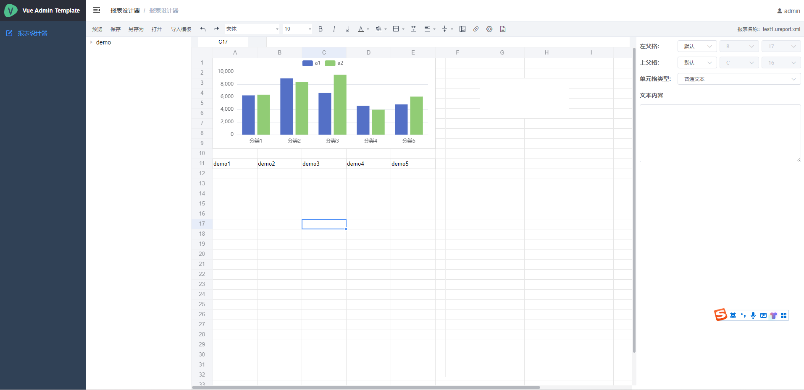
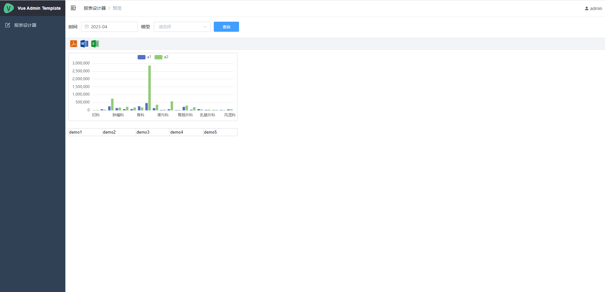

# ureport-community 报表设计器

#### 介绍

<b>本项目基于ureport2开源项目修改而来,主要重构前端，采用vue-admin-template模板框架，前端使用echarts展示图形，下载excel和word采用本身支持的图表</b>

ureport2是一款高性能的架构在Spring之上纯Java报表引擎，通过迭代单元格可以实现任意复杂的中国式报表。
在ureport2中，提供了全新的基于网页的报表设计器，可以在Chrome、Firefox、Edge等各种主流浏览器运行（IE浏览器除外）,打开浏览器即可完成各种复杂报表的设计制作。

#### 软件架构
<b>spring-boot + vue + element-ui + echarts</b>

### 文档视频教程地址
1. WIKI： http://wiki.bsdn.org/display/UR/ureport2+Home
2. w3cschool： https://www.w3cschool.cn/ureport
3. 配置示例 https://gitee.com/lenvoe2019/ureport-community/wikis/pages

### 界面

### 数据源配置
目前项目仅添加了MySQL的驱动包，支持其他数据库需要手动添加驱动包

数据源直接是配置在application.properties配置文件中,不在需要页面直接添加配置数据源

#system datasource support

ureport.support.datasource[0].code=be2a5284483b4edc9291dd2b84c3b5f3

ureport.support.datasource[0].name=demo

ureport.support.datasource[0].url=jdbc:mysql://xxxx:3306/xx

ureport.support.datasource[0].driverClassName=com.mysql.cj.jdbc.Driver

ureport.support.datasource[0].userName=admin

ureport.support.datasource[0].password=1234

ureport.support.datasource是一个数据源数组，配置多个数据源只需修改数组下标

### 启动项目

#### 启动后端项目

使用后端开发工具启动运行项目src/main/java/com/bstek/ReportApplication.java 中的main方法

#### 启动前端项目

前端项目路径ureport-ui

1、安装
npm install

2、运行
npm run dev

注:前端项目目前没有测试接口，直接调用后端服务接口，因此前端项目运行需要启动后端项目才能正常使用

### 其他项目集成报表页面
| URL  | 说明  |
|---|---|
| http://host[:port][/context-path]/ureport/html/报表名称?X-Token=xxxxxx |  展示对应报表html页面 |
| http://host[:port][/context-path]/ureport/word/报表名称?X-Token=xxxxxx  | 导出对应报表的Word文件  |
| http://host[:port][/context-path]/ureport/excel/报表名称?X-Token=xxxxxx | 导出对应报表的Excel文件  |
| http://host[:port][/context-path]/ureport/pdf/报表名称?X-Token=xxxxxx  |  导出对应报表的PDF文件 |

本项目使用JWT生成token，其他项目需要和本项目生成token规则一致即可访问页面

数据权限可通过token传参,并在sql中添加相关条件限制
